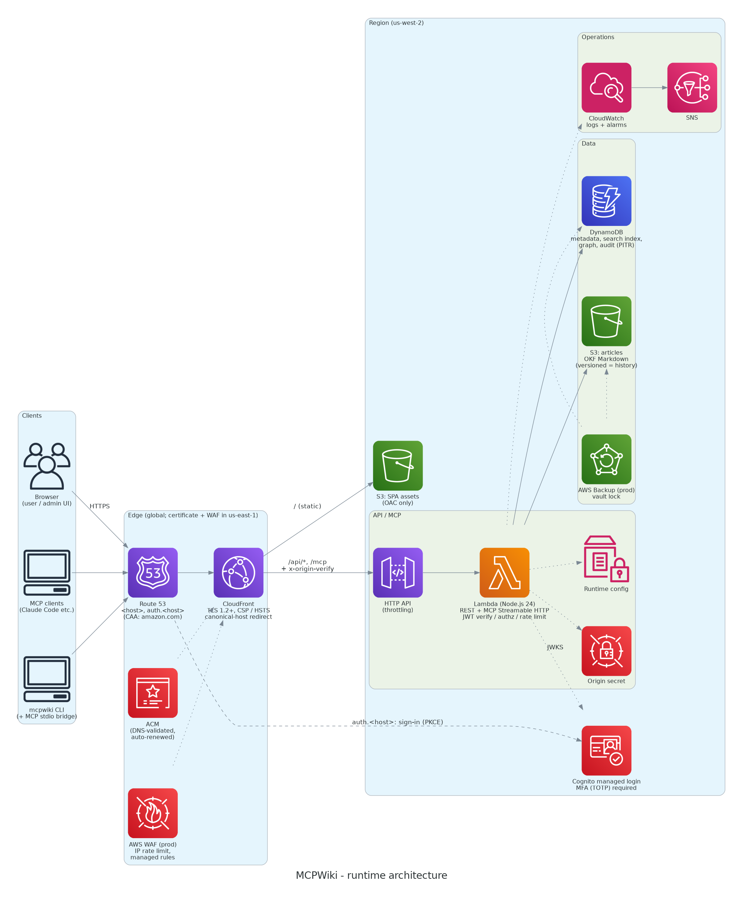
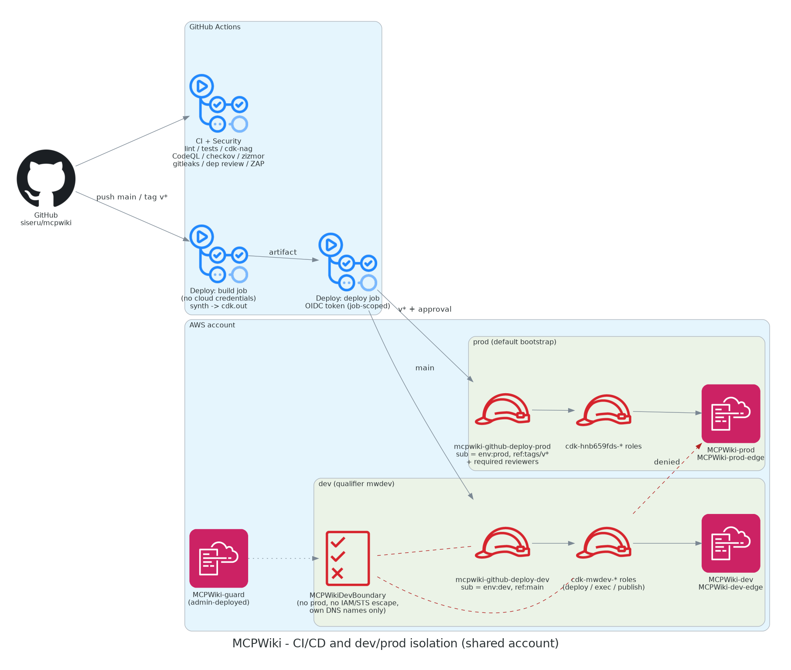

# MCPWiki

English | [日本語](README.md)

A lightweight, serverless wiki designed to be used by LLMs through MCP.

- People use the **web UI**, LLMs use **MCP**, scripts use the **CLI / REST API**. All three can read, create, edit, search and list articles, and all three go through the same permission model.
- Articles are stored as **GitHub-flavored Markdown** with [**OKF (Open Knowledge Format) v0.2**](https://github.com/GoogleCloudPlatform/open-knowledge-format) frontmatter. They can be exported and imported as OKF bundles as-is.
- Links between articles, plus shared tags, form a **knowledge graph**. MCP exposes it through `get_graph` and `get_backlinks`.
- It runs on AWS serverless services with no always-on resources. The design is built around **mandatory MFA**, **least privilege** and **defense in depth**. Security review runs continuously in CI/CD.

## Architecture



| Role | Service | Notes |
|---|---|---|
| DNS / certificates | Route 53 + ACM (us-east-1) | One certificate covers `<host>` and `auth.<host>`. It is DNS-validated, so ACM renews it automatically. A CAA record restricts issuance to Amazon. |
| Delivery | CloudFront + S3 (OAC) | TLS 1.2+, CSP, HSTS. Requests to `*.cloudfront.net` are redirected to the canonical host. |
| Protection | AWS WAF (prod) | Per-IP rate limit, AWS managed rules, logging with credentials redacted |
| Authentication | Cognito User Pool (Essentials, managed login) | TOTP MFA required, invitation only, groups `admin` / `editor` / `viewer` |
| API / MCP | API Gateway HTTP API + Lambda (Node.js 24, arm64) | One function serves both REST and MCP Streamable HTTP. JWTs are verified inside the Lambda. |
| Data | DynamoDB (on-demand, PITR) | Metadata, search inverted index, links (graph), history, audit log, rate limits |
| Content | S3 (versioning) | Each article is an OKF document at `articles/<id>.md`, and S3 object versions serve as the history. The Lambda has no permission to delete objects. |
| Backup | AWS Backup (prod) | Daily backups kept for 35 days, in a vault with a lock (minimum 7 days) |

Search doesn't use OpenSearch. It uses a custom inverted index in DynamoDB: CJK text is indexed as character bigrams and other text as words. The graph doesn't use Neptune and is also stored in DynamoDB. Both choices keep costs down.

### Dependencies

There are only two runtime dependencies: `marked` for Markdown rendering and `DOMPurify` for XSS protection. The YAML frontmatter parser, JWT verification, ZIP handling, MCP server and CLI are all built on Node's standard library. `npm run lint` checks that no other runtime dependency has been added.

## Permission model

Each article has a **read scope** and a **write scope**. All permission checks live in `src/shared/permissions.ts`, and the API, MCP and UI all use them.

| Setting | Values |
|---|---|
| `readScope` | `admin` (admins only) / `owner` (the creator) / `all` (every signed-in user) |
| `writeScope` | `none` (read-only) / `admin` / `owner` / `all` (every editor) |

- Admins can always read and edit. Viewers can never edit. Creating articles requires the editor role or higher. The write scope can never be wider than the read scope.
- An article you can't read never shows up anywhere: not in lists, search, tags, the graph, backlinks or history. Opening it directly returns 404. Search scores and list cursors don't reveal that it exists either.
- Each past revision is also checked against the scope it was written under, so widening an article's scope doesn't expose earlier private versions.
- **Deleting is only possible from the web UI.** Deletion is a soft delete, and admins can restore articles. MCP and the CLI have no delete feature, and the server also rejects delete requests from any token that wasn't issued to the web client.
- **Permissions can only be widened from the web UI.** CLI, MCP and API tokens can only narrow them. This means a prompt-injected agent with shell access still can't make articles public.
- Edits use **optimistic locking**: if your `version` doesn't match the current one, the server returns 409.

## Setup

Prerequisites: Node.js 20+ (CI runs 24), the AWS CLI, administrator credentials, and the default CDK bootstrap in us-west-2 and us-east-1.

```bash
npm ci
npm test                 # unit + E2E tests (API / MCP / CLI)
npm run lint             # static security policy checks
```

### 1. Guard rails for the shared account (once, administrator)

dev and prod share one AWS account. To make sure a compromised dev pipeline can't reach prod or anything else in the account, dev uses its own CDK bootstrap and a permissions boundary. See [docs/security.en.md](docs/security.en.md#dev--prod-isolation-shared-account) for details.

```bash
npm run build
npx cdk deploy MCPWiki-guard          # permissions boundary MCPWikiDevBoundary
node scripts/bootstrap-dev.mjs        # dev-only bootstrap (qualifier mwdev); every role gets the boundary
```



### 2. Custom domain (optional)

Copy `config/domains.example.json` to `config/domains.local.json`. The `.local.json` file is ignored by git.

```json
{ "zoneName": "example.com", "hostedZoneId": "Z0123456789EXAMPLE", "hosts": { "dev": "wiki-dev.example.com", "prod": "wiki.example.com" } }
```

- `MCPWiki-<env>-edge` (us-east-1) creates the ACM certificate for `<host>` and `auth.<host>`, plus the CAA records. The DNS validation records stay in place, so ACM **renews the certificate automatically**. An alarm fires if fewer than 30 days remain.
- CloudFront serves `<host>` with `TLSv1.2_2021`, and the login UI moves to `auth.<host>`. `*.cloudfront.net` returns a 308 redirect to `<host>`.
- If no domain is configured, the wiki keeps running on `*.cloudfront.net`.

### 3. Deploy

```bash
npm run deploy:dev       # MCPWiki-dev-edge + MCPWiki-dev
npm run deploy:prod      # MCPWiki-prod-edge (certificate + WAF) + MCPWiki-prod
scripts/create-admin.sh dev <username> <email> admin   # invite the first admin
```

Sign in with the temporary password from the invitation email, then change the password and register TOTP. Invite further users from the admin UI (`/admin`).
Set the alarm recipient with `MCPWIKI_ALARM_EMAIL=ops@example.com` (or `-c alarmEmail=...`). If it's missing for prod, synth prints a warning.

## CI/CD and continuous security review

| Workflow | Runs on | What it does |
|---|---|---|
| `ci.yml` | PR / main | lint (dependencies, XSS, pinned workflow actions), type check, tests (including security regression tests), `cdk synth` with **cdk-nag**, `npm audit`, `npm audit signatures` |
| `security.yml` | PR / main / weekly | **gitleaks** (secrets across the full history), **OSV-Scanner** (known vulnerable and malicious packages), **Dependency Review** (PRs), **checkov** (synthesized templates), **zizmor** (GitHub Actions audit), **OWASP ZAP** baseline (against dev, weekly), optional **AI review by Claude** |
| `supply-chain.yml` | PRs that change dependencies | **Lockfile review**: blocks versions younger than 7 days, new install scripts, dropped provenance and non-registry sources; warns on publisher changes and new packages; saves runtime dependency diffs. **Infrastructure diff**: synthesizes base and PR and compares them; a dependency-only PR that changes security-relevant resources is blocked. |
| `codeql.yml` | PR / main / weekly | **CodeQL** (security-extended, TypeScript and GitHub Actions) |
| `scorecard.yml` | main / weekly | **OpenSSF Scorecard** |
| `deploy.yml` | main → dev, `v*` tags → prod | Build and synth run in a job that has no cloud credentials. Only the deploy job can get an OIDC token, and it installs with `npm ci --ignore-scripts` and no cache. |

**Private repositories:** code scanning (SARIF upload), Dependency Review and secret scanning need paid GitHub features (GitHub Code Security / Secret Protection). By default the workflows don't use them. Each scanner, CodeQL included, fails its job when it finds something and keeps the report as an artifact. Once the repository is public, or you have the paid features, set the repository variable `CODE_SCANNING_ENABLED=true` and the results are collected in GitHub's Security tab (code scanning). On private repositories, rulesets (branch protection) and environment required reviewers may also depend on your plan.

 Every action is pinned to a commit SHA, and Dependabot keeps the pins up to date.

### One-time GitHub setup

1. Create the deploy roles: `npx cdk deploy MCPWiki-ci -c githubRepo=<owner>/<repo>`
2. Add the git ref to the OIDC subject. The role trust policies require both the environment and the ref to match.
   ```bash
   gh api -X PUT repos/<owner>/<repo>/actions/oidc/customization/sub \
     --input - <<< '{"use_default":false,"include_claim_keys":["repo","context","ref"]}'
   ```
3. When ready, set the repository variable `DEPLOY_ENABLED=true`; until then the Deploy workflow is skipped. Create the `dev` and `prod` environments and set these variables on each: `AWS_DEPLOY_ROLE_ARN` (from the stack outputs), `AWS_ACCOUNT_ID`, `AWS_REGION`, `MCPWIKI_DOMAINS` (optional) and `MCPWIKI_ALARM_EMAIL`.
4. On `prod`, set **Required reviewers**, enable "prevent self-review", and allow deployments only from `v*` tags. On `dev`, allow deployments only from `main`.
5. Protect branches (require PRs, and require CI / Security / CodeQL to pass) and `v*` tags. Enable secret scanning with push protection, and private vulnerability reporting.
6. Optional: set the repository variable `DEV_URL` as the ZAP target. For the AI review, set `ENABLE_AI_SECURITY_REVIEW=true` and the secret `ANTHROPIC_API_KEY`.

## CLI

```bash
npm run build
install -m 755 dist/cli/mcpwiki.mjs ~/.local/bin/mcpwiki     # single file, no dependencies

mcpwiki configure --env dev --url https://wiki-dev.example.com
mcpwiki login                     # browser sign-in with MFA (PKCE)
mcpwiki list --tag aws
mcpwiki search "lambda cold start"
mcpwiki get <id>                  # prints the OKF document (frontmatter + Markdown)
mcpwiki create --title "Runbook" --tags ops,aws --file doc.md
mcpwiki edit <id>                 # edit the OKF document in $EDITOR (optimistic locking)
mcpwiki graph <id> --depth 2 --tags
mcpwiki export --out bundle.zip   # OKF bundle of every article you can read
```

If your browser runs on a different machine, sign in and then paste the final `http://localhost:53682/callback?...` URL into the CLI. Tokens are saved to `~/.config/mcpwiki/credentials.json` (mode 0600) and refreshed automatically.

## MCP

```bash
mcpwiki login --env dev
claude mcp add mcpwiki -- mcpwiki mcp --env dev      # stdio bridge (recommended)
```

The remote endpoint is `https://<host>/mcp` (Streamable HTTP). Unauthenticated requests get a 401 with an RFC 9728 `WWW-Authenticate: Bearer resource_metadata=...` header. The authorization server is Cognito, using PKCE with the pre-registered client `cliClientId` and the callback `http://localhost:53682/callback`.

| Tools | Description |
|---|---|
| `list_articles` / `get_article` / `search_articles` | List articles, get an OKF document (including past versions), full-text search |
| `create_article` / `update_article` | Create (defaults to `status: draft`), partial update (`version` required; permissions can only be narrowed) |
| `list_tags` / `get_graph` / `get_backlinks` | Tags, relationship graph (`link` edges are directed; `tag` edges mean shared tags), backlinks |

Article content is treated as untrusted data. Each response wraps it in a randomly named boundary tag.

## OKF

```markdown
---
type: Wiki Article
title: Tokyo Tower
description: Overview of the 1958 broadcasting tower
tags: [travel, history]
status: stable
generated: { by: "human:taro", at: "2026-10-07T00:00:00.000Z" }
verified:
  - by: "human:hanako"
    at: "2026-10-08T00:00:00.000Z"
mcpwiki: { id: tokyo-tower, owner: taro, read_scope: all, write_scope: owner, version: 3, ... }
---

Body… [related](/wiki/other-article)
```

- Link to other articles with `[label](/wiki/<id>)`. `/wiki/<id>.md` and relative `<id>.md` links are recognized too.
- `generated.by` is `human:<user>` for web and CLI edits, and `mcpwiki-mcp/<version>` for MCP edits. "Mark as reviewed" adds an entry to `verified`, and content changes reset it.
- Extension keys are preserved. An exported bundle contains `index.md` (with `okf_version: "0.2"`) and `wiki/<id>.md` files.

## Cost

At small scale (tens of users, thousands of articles), dev costs a few USD per month. prod adds WAF (about 9 USD per month), WAF logs and Backup (which scales with data size), for an expected total of about 10–20 USD per month. There are no always-on resources.

## Layout

```
src/shared   permissions, OKF, YAML subset, tokenizer, validation (shared by API / web / CLI)
src/backend  Lambda: routing, JWT verification, business logic, MCP, DynamoDB/S3 store, ZIP
src/web      SPA (user and admin UI)
src/cli      mcpwiki CLI and MCP stdio bridge
src/infra    CDK: WikiStack / EdgeStack / GuardStack / CiStack
test         node:test (E2E and security regression tests)
scripts      build / lint / smoke / create-admin / bootstrap-dev / diagrams
docs         design documents and diagrams
```

Security design: [docs/security.en.md](docs/security.en.md) / reporting vulnerabilities: [SECURITY.md](SECURITY.md)

## License

Apache License 2.0 ([LICENSE](LICENSE))
